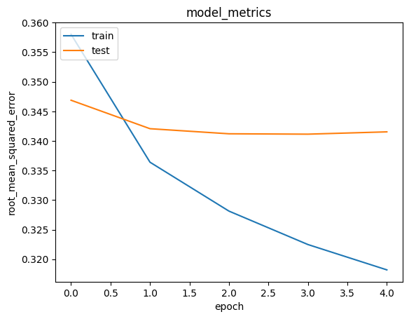

# Laporan Proyek Machine Learning - Iva Raudyatuzzahra

## Project Overview

 Saat ini, terdapat ribuan bahkan jutaan judul buku yang tersedia di pasaran. Pilihan yang terlalu banyak ini dapat membuat pengguna kesulitan dalam menemukan buku yang sesuai dengan minat dan preferensinya. Book recommender system membantu mengurangi kerumitan ini dengan memberikan rekomendasi buku yang sesuai dengan selera individu.

 Setiap pembaca memiliki minat, preferensi, dan kesukaan yang berbeda-beda. Sistem rekomendasi buku menggunakan algoritma dan data pengguna untuk memahami preferensi individual dan menyarankan buku-buku yang sangat mungkin disukai oleh pengguna tersebut. Personalisasi ini meningkatkan pengalaman pembaca dan dapat memperluas pengetahuan mereka.

 Bagi toko buku atau platform e-commerce, sistem rekomendasi buku dapat meningkatkan penjualan dengan menawarkan buku-buku yang relevan kepada pembaca potensial. Rekomendasi yang akurat dan personalisasi dapat mendorong pembelian impulsif atau mengeksplorasi buku-buku baru yang tidak akan ditemukan pengguna secara mandiri.

 Sistem rekomendasi buku juga membantu dalam menjangkau audiens baru dengan mengenalkan buku-buku yang mungkin tidak dikenal sebelumnya oleh pembaca. Dengan menghadirkan buku-buku dari berbagai genre dan penulis, sistem ini dapat membuka pintu bagi eksplorasi literatur yang lebih luas.
 
 Dengan memberikan rekomendasi yang relevan dan berkualitas, sistem rekomendasi buku membantu mengoptimalkan pengalaman pengguna secara keseluruhan. Pengguna akan merasa lebih puas dan terlibat dengan platform atau layanan yang menyediakan rekomendasi yang sesuai dengan minat mereka.
 
 Penggunaan sistem rekomendasi buku juga memberikan manfaat dari segi analisis data. Data yang dikumpulkan tentang preferensi pembaca dapat memberikan wawasan berharga tentang tren bacaan, preferensi pasar, dan pola konsumsi yang dapat dimanfaatkan oleh toko buku atau penerbit untuk mengoptimalkan strategi bisnis mereka.

 Dengan begitu banyak pilihan buku yang tersedia, sistem rekomendasi buku menjadi alat yang berharga bagi pembaca dan penyedia layanan dalam menyederhanakan proses pencarian buku yang sesuai dengan minat dan preferensi individu.

## Business Understanding

### Problem Statements

- Bagaimanakah cara merekomendasikan buku berdasarkan preferensi pembaca?

### Goals

- Membuat sistem rekomendasi buku yang sesuai dengan preferensi berdasarkan data riwayat pembaca

### Solution statements
- Proyek ini akan membuat sistem rekomendasi buku menggunakan collaborative filtering.

## Data Understanding
Proyek ini menggunakan dataset Book Recommendation Dataset yang diunduh dari Kaggle. Informasi mengenai dataset ini adalah sebagai berikut:

1. Terdiri dari 3 dataset yang memiliki format CSV (Comma-Seperated Values).
2. Books dataset memiliki 271360 entri data dan 8 fitur.

Tabel 1. Informasi Books Dataset
| No | Column              | Dtype  | Keterangan                    |
|----|---------------------|--------|-------------------------------|
| 0  | ISBN                | object | merupakan data identitas buku |
| 1  | Book-Title          | object | judul buku                    |
| 2  | Book-Author         | object | nama penulis buku             |
| 3  | Year-Of-Publication | object | tahun terbit                  |
| 4  | Publisher           | object | penerbit                      |
| 5  | Image-URL-S         | object | gambar buku berukuran kecil   |
| 6  | Image-URL-M         | object | gambar buku berukuran sedang  |
| 7  | Image-URL-L         | object | gambar buku berukuran besar   |

3. Users dataset memiliki 278858  entri data dan 3 fitur.

Tabel 2. Informasi Users Dataset
| No | Column   | Dtype   | Keterangan                       |
|----|----------|---------|----------------------------------|
| 1  | User-ID  | int64   | merupakan data identitas pembaca |
| 2  | Location | object  | lokasi pembaca                   |
| 3  | Age      | float64 | usia pembaca                     |

4. Ratings dataset memiliki 1149780   entri data dan 3 fitur.

Tabel 3. Informasi Rating Dataset
| No | Column      | Dtype  | Keterangan                       |
|----|-------------|--------|----------------------------------|
| 1  | User-ID     | int64  | merupakan data identitas pembaca |
| 2  | ISBN        | object | merupakan data identitas buku    |
| 3  | Book-Rating | int64  | rating buku                      |

5. Terdapat _missing values_ dalam dataset.

## Data Preparation
1. Menggabungkan data rating dan data buku dengan fungsi merge menggunakan data ISBN yang terdapat di kedua dataset
2. Menggabungkan data user dan data rating_book di atas menggunakan kolom User-ID
3. Menghapus fitur yang tidak diperlukan yaitu "ISBN","Image-URL-S","Image-URL-M","Age" menggunakan drop() method. Langkah ini dilakukan untuk meningkatkan kualitas data dengan meniadakan fitur yang tidak relevan.

4. Mengecek _missing value_ menggunakan isnull() method. Hasilnya adalah sebagai berikut:

Tabel 4. Jumlah Missing Value
|      **Column**     | **Missing Values** |
|:-------------------:|:------------------:|
| User-ID             |                  0 |
| Book-Rating         |                  0 |
| Book-Title          |             118644 |
| Book-Author         |             118645 |
| Year-Of-Publication |             118644 |
| Publisher           |             118646 |
| Image-URL-L         |             118648 |
| Location            |                  0 |

5. Menangani missing value. Terdapat beberapa perlakuan yang dapat dilakuakn untuk mengatasi ketiadaan data, yaitu:
- membuang data (baris atau kolom) yang mengandung _missing value_ didalamnya
- Mengisi data yang hilang tersebut dengan data tertentu yang dianggap mendekati. Pengisian data (Imputation) dapat menggunakan nilai rata-rata untuk fitur numerik atau menggunakan modus data (data yang memiliki frekuensi muncul terbanyak).

Pada proyek ini, _missing value_ dihapus menggunakan dropna() karena jumlah data yang mengandung _missing value_ cukup sedikit jika dibandingkan total keseluruhan data sehingga pengaruhnya tidak signifikan. Tahap ini dilakukan untuk meningkatkan kualitas data.

6. Split Location yang terdiri lebih dari satu lokasi untuk mendapatkan wawasan yang lebih mendalam tentang lokasi pengguna.
7. Berikut adalah 3 buku yang memiliki jumlah rating tertinggi:

Tabel 5. Top 3 Buku dengan rating terbanyak
|       **Book-Title**      | **num_ratings** | **avg_ratings** |
|:-------------------------:|:---------------:|:---------------:|
| Wild Animus               |            2502 |        1.019584 |
| The Lovely Bones: A Novel |            1295 |        4.468726 |
| The Da Vinci Code         |             898 |        4.642539 |

Data tersebut diperoleh dengan membuat dataframe baru terlebih dahulu. Dataframe ini berisi nilai hasil agregasi rating berdasarkan judul buku, kemudian dihitung rata-rata ratingnya, dan setelah itu jumlah rating diurutkan dari yang tertinggi.

## Data Preprocessing
1. Menyandikan (encode) fitur User-ID dan ISBN ke dalam indeks integer
2. Mengubah tipe data rating menjadi float
3. Mengacak dataset dengan parameter random state = 42
4. Membagi dataset menjadi train data dan test data dengan perbandingan 70:30

## _Modelling_
Proyek ini menggunakan 1 model yaitu *Collaborative Filtering*. *Collaborative Filtering* adalah salah satu metode yang sering digunakan dalam sistem rekomendasi untuk menyajikan rekomendasi berdasarkan kolaborasi atau interaksi antara pengguna dengan item (buku, film, produk, dll.). Konsep utama di balik collaborative filtering adalah mencari pola kesamaan atau korelasi antara perilaku pengguna dan item yang telah diberi peringkat atau diulas oleh pengguna lain. Dalam konteks rekomendasi buku, collaborative filtering mencoba mengidentifikasi kesamaan antara preferensi pembaca berbeda untuk menyajikan rekomendasi buku yang sesuai dengan minat pengguna.

**Kelebihan Collaborative Filtering**:

1. **Personalisasi**: Collaborative filtering dapat menyediakan rekomendasi yang sangat personal karena didasarkan pada preferensi dan interaksi aktual pengguna dengan item.

2. **Tidak Memerlukan Data Produk**: Metode ini tidak memerlukan informasi rinci tentang item (buku) yang akan direkomendasikan, sehingga lebih mudah diterapkan daripada metode yang memerlukan deskripsi dan atribut produk yang lengkap.

3. **Efektif untuk Item Baru**: Collaborative filtering dapat dengan mudah menangani item baru yang belum banyak diulas atau diberi peringkat oleh pengguna, karena berfokus pada interaksi antara pengguna tanpa memerlukan informasi terperinci tentang item.

4. **Tidak Memerlukan Pengetahuan Domain**: Metode ini bekerja tanpa perlu pengetahuan mendalam tentang konten buku atau fitur yang harus dianalisis, yang dapat mengurangi kompleksitas implementasi.

**Kekurangan Collaborative Filtering**:

1. **Cold Start Problem**: Sistem collaborative filtering kesulitan memberikan rekomendasi kepada pengguna baru yang belum memiliki sejarah interaksi dengan item. Hal ini disebut masalah "Cold Start," karena tidak ada data untuk mengidentifikasi preferensi pengguna baru.

2. **Data Sparse**: Ketika jumlah pengguna dan item sangat besar, data yang dihasilkan bisa sangat jarang. Akibatnya, kesulitan dalam mengidentifikasi pola dan memberikan rekomendasi yang akurat dapat terjadi.

3. **Efek Populeritas**: Collaborative filtering cenderung lebih mempromosikan item populer atau mainstream, karena item-item ini mendapatkan lebih banyak interaksi dan peringkat dari pengguna.

4. **Masalah Skala**: Dalam kasus sistem besar, mencocokkan data untuk memberikan rekomendasi dapat menjadi sangat mahal secara komputasi, dan bisa memakan waktu.

5. **Filtering Buruk**: Jika tidak ada cukup data kolaboratif yang relevan, sistem dapat menghasilkan rekomendasi yang buruk atau tidak relevan, terutama ketika preferensi pengguna tidak mencerminkan selera umum.

Langkah modelling yang dilakukan:
1. Menginisialisasi model RecommenderNet
2. Melakukan proses embedding terhadap data user dan book
3. Melakukan operasi perkalian dot product antara embedding user dan book serta menambahkan bias untuk setiap user dan book. Skor kecocokannya ditetapkan dalam skala [0,1] dengan fungsi aktivasi sigmoid melalui Class RecommenderNet
4. Melakukan training dengan model RecommenderNet batch size 10 dan epoch 25

## Prediksi
Langkah-langkah yang dilakukan:
1. Mengambil user_id secara acak dari rating_dataset
2. Memahami riwayat bacaan pengguna untuk mengetahui buku yang sudah dan belum dibaca agar hasil rekomendasi menunjukan buku yang belum dibaca pengguna
3. Merekomendasikan 5 buku dari preferensi bacaan user

Tabel 6. Top 5 Rekomendasi Buku untuk User 16966
|                        **Judul Buku**                       |      **Penulis**     |
|:-----------------------------------------------------------:|:--------------------:|
| Foreign Legions                                             | Eric Flint           |
| The Coelura                                                 | Anne McCaffrey       |
| Cetaganda (Bujold, Lois Mcmaster. Vorkosigan Adventure.)    | Lois McMaster Bujold |
| Stocking Stuffers  Homoerotic Christmas Tales               | David Laurents       |
| The Probability Broach                                      | L. Neil Smith        |

## Evaluasi
Model ini menggunakan Binary Crossentropy untuk menghitung loss function, Adam (Adaptive Moment Estimation) sebagai optimizer, dan root mean squared error (RMSE) sebagai metrics evaluation.

Root Mean Square Error (RMSE) merupakan besarnya tingkat kesalahan hasil prediksi, dimana semakin kecil (mendekati 0) nilai RMSE maka hasil prediksi akan semakin akurat. Root Mean Squared Error (RMSE) merupakan salah satu cara untuk mengevaluasi model regresi linear dengan mengukur tingkat akurasi hasil perkiraan suatu model. RMSE dihitung dengan mengkuadratkan error (prediksi “ observasi) dibagi dengan jumlah data (= rata-rata), lalu diakarkan. RMSE tidak memiliki satuan. Root Mean Square Error merupakan salah satu kriteria dalam menentukan model peramalan selain MAPE, MAD dan MSE. Nilai RMSE rendah menunjukkan bahwa variasi nilai yang dihasilkan oleh suatu model prakiraan mendekati variasi nilai observasinya. RMSE menghitung seberapa berbedanya seperangkat nilai. Semakin kecil nilai RMSE, semakin dekat nilai yang diprediksi dan diamati.

Loss function digunakan untuk mengukur kesalahan antara keluaran prediksi dan nilai target yang diberikan. Sebuah loss function memberitahu kita seberapa jauh model algoritma dari mewujudkan hasil yang diharapkan. Kata ‘loss’ berarti penalit/hukuman yang didapat model karena gagal memberikan hasil yang diinginkan. Fungsi ini akan menentukan kinerja model dengan membandingkan keluaran yang diprediksi dengan keluaran yang diharapkan. Jika deviasi antara y_pred dan y sangat besar, nilai loss akan sangat tinggi.

Model konvergen pada  nilai error akhir sebesar sekitar 0.318. Nilai tersebut sudah cukup bagus untuk digunakan dalam sistem rekomendasi.

Dapat disimpulkan model sistem rekomendasi ini sudah dapat memberikan rekomendasi buku berdasarkan preferensi pembaca dengan baik.

## Referensi
[1] Arash. "Book Recommendation Dataset". Kaggle. https://www.kaggle.com/datasets/arashnic/book-recommendation-dataset/code?datasetId=1004280&sortBy=voteCount[diakses pada 30 Juli 2023]
[2] Dicoding. "Kelas Machine Learning Terapan." https://www.dicoding.com/academies/319 [diakses pada 30 Juli 2023]
[3] Hutapea, Agustina. "Sistem Rekomendasi Menggunakan Metode Collaborative Filtering dan Algoritma Apriori". 2021. https://repository.unsri.ac.id/54754/65/RAMA_55201_09021281621057_0008118205_0028068806_01_front_ref.pdf [diakses pada 30 Juli 2023]
[4] Maulid, Reyvan. "Kriteria Jenis Teknik Analisis Data dalam Forecasting". 2022. https://dqlab.id/kriteria-jenis-teknik-analisis-data-dalam-forecasting#:~:text=Root%20Mean%20Square%20Error%20(RMSE,hasil%20prediksi%20akan%20semakin%20akurat. [diakses pada 31 juli 2023]
[5] Softscients. "Loss Function pada Machine Learning". 2023. https://softscients.com/2022/03/14/loss-function-pada-machine-learning/ [diakses pada 31 Juli 2023]

**---Ini adalah bagian akhir laporan---**